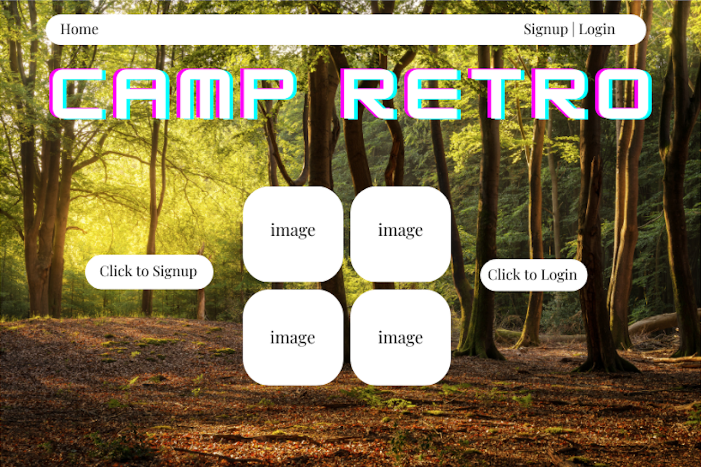
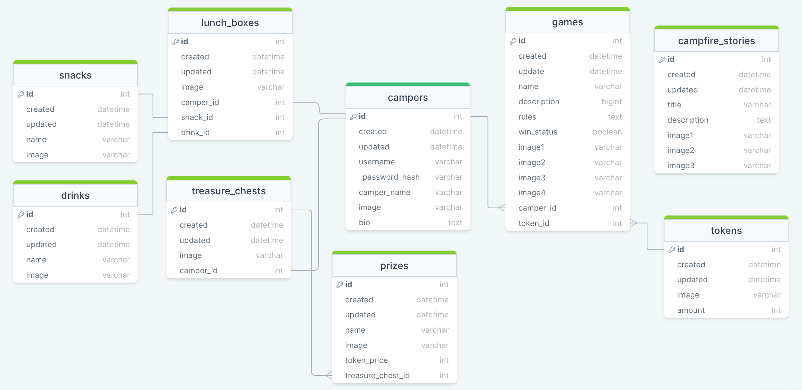

# 🌲🌖 camp retro 🏕️

No camp counselors. Just games, prizes, and retro fun!

---

A Camp Retro User can:

1. Take a break from doom scrolling social media and Sign up for an adventure at Camp Retro
2. Create a Camper profile (camper name, profile image & bio) to showcase their unique personality
3. Fill their lunchbox with snacks and a drink for a long day of adventures
4. Play childhood games like Tic-Tac-Toe, Rock Paper Scissors, and Treasure Hunt
5. Beat the games and win magic tokens
6. Cash in those tokens for nostalgic prizes to store in their personal Treasure Chest
7. Relax after a long day of games with smores and campfire stories

---

## Wireframes

---

## React Tree

## 

---

## Client Side Routes

| Client Route  | Component          |
| ------------- | ------------------ |
| /             | Home.js            |
| /login        | Login.js           |
| /signup       | Signup.js          |
| /camp         | Camp.js            |
| /camp/cabin   | CampCabin.js       |
| /treasure     | TreasureChest.js   |
| /lunchbox     | LunchBox.js        |
| /games        | Games.js           |
| /games/:id    | OneGame.js         |
| /prizes       | PrizeRoom.js       |
| /prizes/:id   | OnePrize.js        |
| /snackbar     | SnackBar.js        |
| /snacks/:id   | Snack.js           |
| /drinks/:id   | Drink.js           |
| /campfire     | CampfireStories.js |
| /campfire/:id | OneStory.js        |

---

## ERD

## 

---

## API Routes

| API Route             | Request Method | Body                                          | Response                                                                                        |
| --------------------- | -------------- | --------------------------------------------- | ----------------------------------------------------------------------------------------------- |
| /campers              | GET            |                                               | [{...},{...},...]                                                                               |
| /campers/:id          | GET            |                                               | {id, username, camper_name, image, bio}                                                         |
| /campers/:id          | PATCH          | {username, camper_name, image, bio}           | {id, username, camper_name, image, bio}                                                         |
| /campers/:id          | DELETE         |                                               | {}                                                                                              |
| /lunch_boxes/:id      | GET            |                                               | {id, image, camper_id, snack_id, drink_id}                                                      |
| /lunch_boxes/:id      | PATCH          | {snack_id, drink_id}                          | {id, image, camper_id, snack_id, drink_id}                                                      |
| /snacks               | GET            |                                               | [{...},{...},...]                                                                               |
| /snacks/:id           | GET            |                                               | {id, name, image}                                                                               |
| /drinks               | GET            |                                               | [{...},{...},...]                                                                               |
| /drinks/:id           | GET            |                                               | {id, name, image}                                                                               |
| /treasure_chests/:id  | GET            |                                               | {id, image, camper_id}                                                                          |
| /prizes               | GET            |                                               | [{...},{...},...]                                                                               |
| /prizes/:id           | GET            |                                               | {id, name, image, token_price, treasure_chest_id}                                               |
| /prizes/:id           | PATCH          | {treasure_chest_id}                           | {id, name, image, token_price, treasure_chest_id}                                               |
| /games                | GET            |                                               | [{...},{...},...]                                                                               |
| /games/:id            | GET            |                                               | {id, name, description, rules, win_status, image1, image2, image3, image4, camper_id, token_id} |
| /games/:id            | PATCH          | {camper_id}                                   | {id, name, description, rules, win_status, image1, image2, image3, image4, camper_id, token_id} |
| /tokens/:id           | GET            |                                               | {id, image, amount}                                                                             |
| /campfire_stories     | GET            |                                               | [{...},{...},...]                                                                               |
| /campfire_stories/:id | GET            |                                               | {id, title, description, image1, image2, image3}                                                |
| /signup               | POST           | {username, password, camper_name, image, bio} | {id, username, camper_name, image, bio}                                                         |
| /login                | POST           | {username, password}                          | {id, username, camper_name, image, bio}                                                         |
| /authorized-session   | GET            |                                               | {id, username, camper_name, image, bio}                                                         |
| /logout               | GET            |                                               |                                                                                                 |

---

## trello

